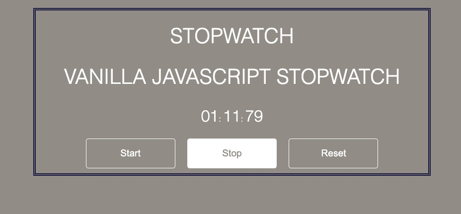

# Stopwatch-with-Vanilla-Javascript

This is a simple Stop Watch application built with HTML SAAS SCSS transpiled to CSS and Javascript.

Project Status
This project is complete with core stopwatch functionalities. Users can add start the timer with the 'start button', pause timer with the 'stop button' as well as reset the timer with the 'reset button'.

Project Screen Shot(s)

Setup Instructions
Clone down this repository.
open the folder in your IDE.
Install Live server if you are on VS Code.
Navigate to the index.html file and open with live server.
You can also open the Index.html file directly with your browser.

Reflection

In this project, I built a Vanilla Javascript stopwatch application. The Stopwatch application implements basic javascript functions like setInterval, clearInterval etc as well as custom functions that makes use of event listeners like onClick etc

At the end of the day, the technologies implemented in this project are Vanilla Javascript, HTML, SAAS SCSS, and CSS. I chose to use the SAAS SCSS in order to avoid code repetition which can lead subtle mistakes or mix ups. Instead the SCSS file is transpiled into CSS on clicking watch. It helps to bundle repetitive style properties into a form of object that can simply be passed around as needed.